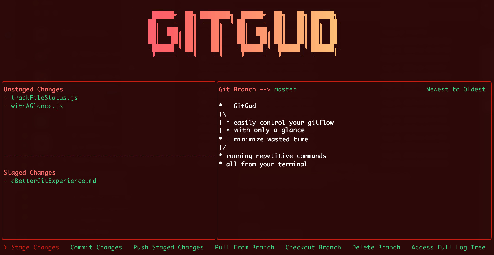
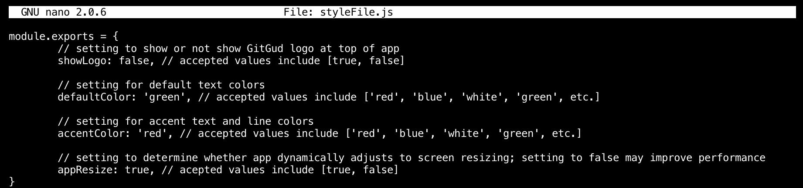

<h1 align="center">
	<br>
	
	<br>
	<br>
</h1>

# GitGud

 ## **Introduction**

GitGud is an open-source repository designed to provide beginners and experienced developers with a platform to learn and enhance their Git skills. The repository is built with the aim of providing an interactive learning experience for developers of all skill levels. Whether you're just getting started with Git or looking to improve your existing skills, GitGud provides an extensive set of resources and tools that can help you master Git. GitGud allows you to easily visualize and fully utilize git throughout your projects. It is created using [Ink](https://github.com/vadimdemedes/ink) which provides the same component-based UI building experience that React offers, but in a Command Line Interface (CLI).


 ## **Requirements**
 - Have at least **git version 2.24.3** installed
 - Have [npm](https://www.npmjs.com/get-npm) installed
 - We do not recommend using [iTerm2](https://iterm2.com/) for GitGud due to rendering issues. [Hyper](https://hyper.is/) or the default terminal are good alternatives.


---

## **Installation**
```
$ npm install --global gitgud
```

---

This will install the package globally
## **Usage**
```
$ GitGud
```
- Navigate to any project that has a git directory in it and run the 'gitgud' command. This will load the gitgud UI to your terminal window

- The GitGud UI consists of: Unstaged Changes, Staged Changes, Git Branch tree view and functionality buttons
- Navigate through the UI with either the 'tab' button or left/right arrow keys
- Press 'enter/return' button to select/click an option
- Throughout the app you can hit the 'esc'(escape) button to go back
- You can exit the app by running ctrl + c

---
## **Functionality**
* ### **Stage Changes**
  - You can select `STAGE/UNSTAGE (all files)` to move all the files between Stage Changes and Unstage Changes.
  - If you click it once it will move all files from 'Unstaged Changes' section of UI to 'Stage Changes'. If you click it again it will undo the 'Staged Changes' and move files back to 'Unstaged Changes' and so on.
  - You also have the option to stage/unstage individual files by navigating through them with the up/down keys.
  - Press 'ESC' to exit out of stage changes menu.
* ### **Commit Changes**
  - It will prompt you to enter a 'Commit Message' which **does not require** you to wrap input in quotation marks. After entering and submitting the commit message, it run the commit and bring you back to the main menu.
  - Press 'ESC' to exit out of commit changes.
* ### **Push Staged Changes**
  - This will push staged changes to the current branch you are on.
  - You can see what branch you are on on the top of the GUI.
* ### **Checkout Branch**
  - It will display list of all the branches in the project. The branches are not selectable, they are there to help you see which local branches are available to switch to.
  - You are prompted to enter a branch to Checkout. If you enter a branch that does not exist, it will create a new one.
  - If you have unstaged changes, an error will be shown and it will abort the checkout operation, telling you that you have unstaged changes and to commit or stash the changes before switching branches. You can press 'ESC' to go back and stash/commit the changes before you attempt to checkout again
* ### **Delete Branch**
  - It will display list of branches which are not selectable, they are there to help you see which local branches are available.
  - You are prompted to enter a branch name, and if the branch exists it will delete/remove it and bring you back to main menu. If the branch does not exist then it will throw an error.
  - Press 'ESC' to exit out of delete branch
* ### **Access Full Log Tree**
   - It will render the entire log tree overlaying the gitgud GUI.
   - Press 'ESC' to exit out of log tree

---
## **Styling**
Gitgud allows users to customize both the look and feel of the app by editing the 'stylefile.'

To access the 'stylefile' of a globally installed GitGud, you will first need to find out where NPM is saving your globally installed files. To do so, run the following command:
```
npm root -g
```
This will return the location of your globally installed NPM packages.

On Mac you should see something like this: */usr/local/lib/node_modules*

On Windows, you may get this: *C:\Users\YOU\AppData\Roaming\npm\node_modules

Navigate to where your global packages are stored, open the gitgud folder, and then open the styleFile in an editor (the command: `nano styleFile.js` will open it in most mac/linux systems).

When you open the file it will look like this:



* ### **`showLogo`:**
   - By default this is set to `false`, but if you want to have the GitGud logo on top of your GUI you can change this to `true`.

* ### **`defaultColor`:**
   - This is the color for the main text blocks throughout the app.

* ### **`accentColor`:**
   - This is the color for the app borders as well as some text headers throughout the app.

* ### **`gitTreeColor`:**
   - This is the color for git tree font throughout the app.

* ### **`appResize`:**
   - This enables the app to be responsive, allowing users to resize their console windows without having to restart the app. This may decrease performance for some users.

* ### **`showFlag`:**
   - Allows user to chose whether or not to display git output tags by the staged/unstaged files.
   - Set to `false` by default.
   - see [here](https://git-scm.com/docs/git-status) for more info about git output tags
---

### **FAQs**
---
### **Contributing**
GitGud is a fully open source project and contributions are welcome!

When submitting a pull request, please clearly explain the feature you added or the bug you fixed.

First-time contributors are welcome as well! There are some issues marked with the `good first issue` tag. These might be a good place for beginners to start!


Thanks to [`Joseph Garrone`](https://github.com/JosephGarrone) for giving us the NPM package name.
